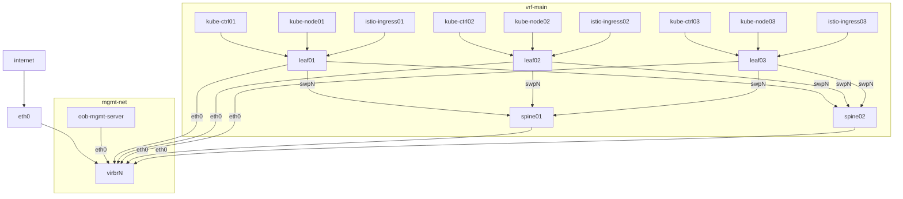

# libvirt-network-topology-tf

Some shell Terraform scipts to create a basic 2 leaf 2 spine topology from Debian Cloud machines.



### USAGE

1. Use `make` to create virtual machines
    ```command
    make create
    ```
1. Use `make` to converge Ansible configuration
    ```command
    make converge
    ```
1. Use `make` to destroy virtual machines
    ```command
    make destroy
    ```

#### Remote libvirt

Set `libvirt_local=false` and `libvirt_host` variables to 

```sh
cat > .auto.tfvars <<EOF
libvirt_local=false
libvirt_host="user@host.example.com"
EOF
```

> NOTE: macOS needs `cdrtools` for cloudinit disk: `brew install cdrtools`

