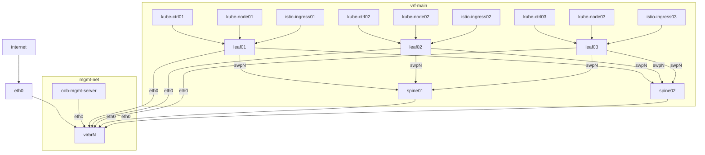

# libvirt-istiolab-tf

Some Terraform and Ansible scipts to create a 3 leaf + 2 spine + 9 host topology from Debian Cloud machines.



### USAGE

1. Use `make` to create virtual machines
    ```command
    make create
    ```
1. Use `make` to converge Ansible configuration. This provisions Kubernetes cluster using `kubeadm`:
    - `kube-ctrl01..03` - control plane nodes
    - `kube-node01..03` - worker nodes
    - `istio-ingress01..03` - Istio external ingress gateway nodes (WIP)
    ```command
    make converge
    ```
1. Use `make` to view SSH commands for connecting to virtual machines
    ```command
    make show
    ```
1. Follow [instructions to provision Calico and Istio](https://gist.github.com/lukassup/82cccb83a18b3510b925b6c771065efa)
1. Use `make` to destroy virtual machines
    ```command
    make destroy
    ```

#### Remote libvirt

Set `libvirt_local=false` and `libvirt_host` variables to 

```sh
cat > .auto.tfvars <<EOF
libvirt_local=false
libvirt_host="user@host.example.com"
EOF
```

> NOTE: macOS needs `cdrtools` for cloudinit disk: `brew install cdrtools`

